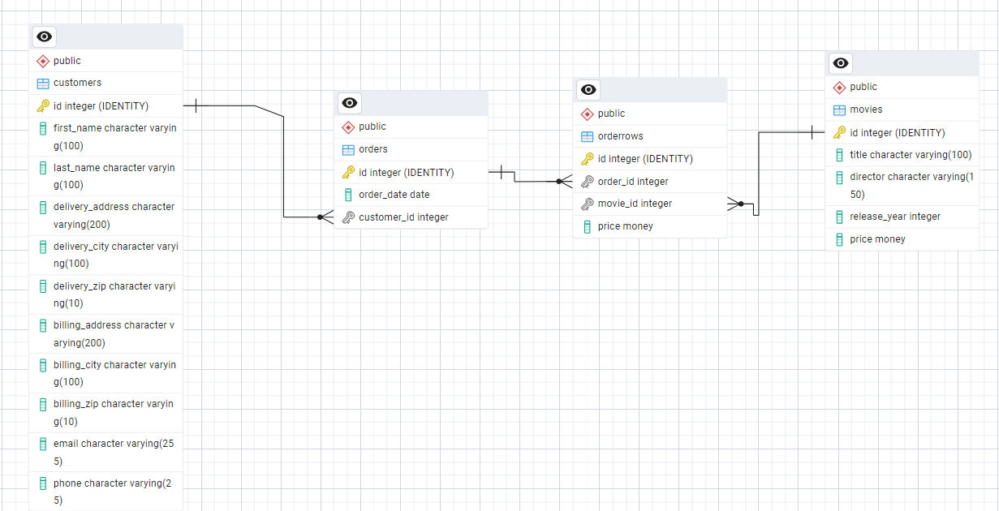

# LEXICON - Fullstack React
## Database
### Assignment 1

#### Features
- Create a database for a web shop of DVD movies with following entities and
relationship
    - **movie:** The movies are the products being sold in the web shop
    - **customer:** Makes an order to the web shop and supplies information for
billing and delivery of order
    - **order:** order details are saved to the database
    - **orderrows:** Maintains the sale details of all orders.
    - Following diagram describes the required columns and their relationship
among tables within database


- **Relation:** Each order is related to one customer and one or more order rows, which in turn contains the price of movies being sold in that order .
- **Why is the Price column included in both the movies and the orderrows tables?**
Because the movie - DVD price may change at any time in future. For a record we can trace the older price of the movie.  
For example let’s say a customer, Joe, buys the movie Se7en on January 12th 2025 for 179 kr. One year later, the price of Se7en is lowered to 79 kr. If we do not keep the Price column in the orderrows table, we lose the price of the movie at time it was sold to Joe.  
The price-column in the movie table represents the current price of the movie. However, the price-column in the orderrows table represents the price of the movie at the time it was sold.

#### Exercise 1 - CREATE DATABASE AND TABLES
- Create all tables, as mentioned in diagram
- Table names and column names should be exactly same as mentioned in diagram,
even no misspellings allowed.
- Set primary key and REFERENCES to other tables as mentioned in diagram
- Create the tables in right order, which will help you to reference to correct table.
- Select the appropriate datatype for each column
- Primary key should be automatically increased while adding new record to table
- No column should allow NULL values.

#### Exercise 2 - INSERT
- Insert following data to movies and customers table
- At least one record in each table should be inserted using INSERT query. (You can also enter data directly to table)


#### Exercise 3 - INSERT
- Write a queries to create orders and orderrows for the following scenarios
    - On 2025-01-01, Jonas Gray purchases Interstellar and Pulp Fiction
    - On 2025-12-15, Peter Birro purchases 2 copies of The Wolf of Wall Street.
    - On 2026-03-20, Jonas Gray purchased The Wolf of Wall Street or select the title of the movie, available in your movie table.  
 (**Tip:** You should create the order first, otherwise you will not have  order_id, which will be required while creating the orderrows.)
 
 *Query example:*
 ```
 INSERT INTO orders
 VALUES(…….)
 SELECT TOP 1 Id FROM orders ORDER BY Id DESC --Get the latest inserted order_id
 INSERT INTO orderrows
 VALUES(….)
 ```

#### Exercise 4 – UPDATE
- Write a query that changes the price of all movies made in 2014 to 169 kr.

#### Exercise 5 – SELECT
- Write queries for the following SELECT operations:
    - Get first_name, Last_name, phone and email to all customers.
    - Get all movies, ordered by year from newest to oldest.
    - Get all movie titles, ordered by price, from cheapest to most expensive.
    - Get first_name, Last_name, delivery__address, delivery_zip, delivery_city
for all customers who bought The Wolf of Wall Street.
    - Get Id, Date, customer (first_name, last_name) and total cost of every
individual order.
    - (Optional) Get customer (first_name, last_name), total number of movies
ordered by this customer, number of orders by this customer and total cost of all orders by this customer.
    - (Optional) Get number of orders and total cost for all orders in the
database.

#### Exercise 6
- Add a new column, mobile to the customers table. The column should contain the
customer’s cellphone number. (The old column, phone currently holds cellphone numbers only. )
- Write a query to copy the information from phone to mobile.
- Write a query to empty the phone column(Sets it to an empty string)
